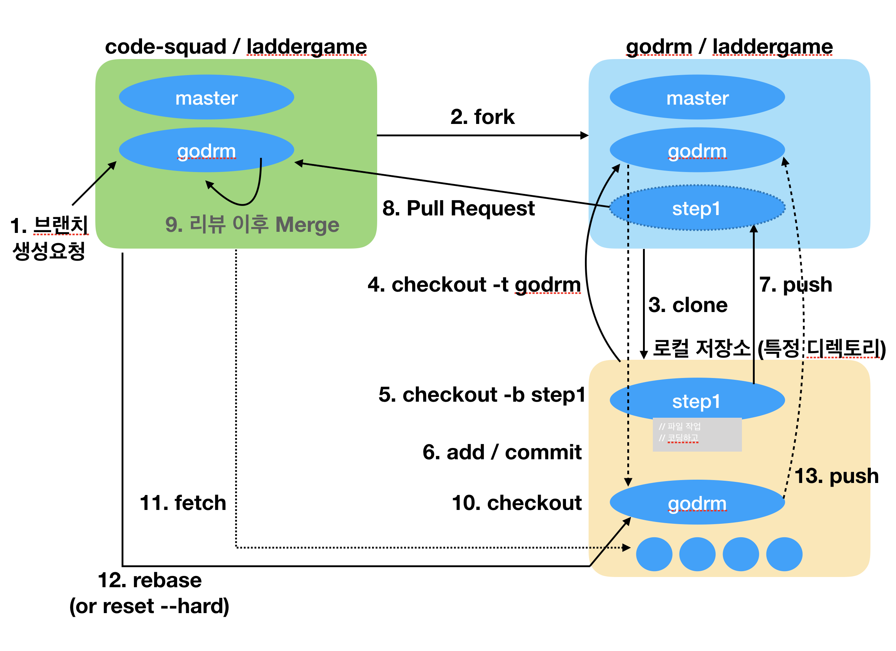
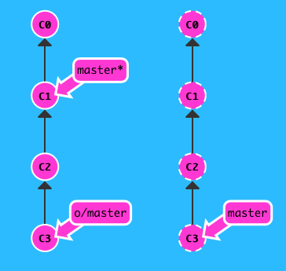
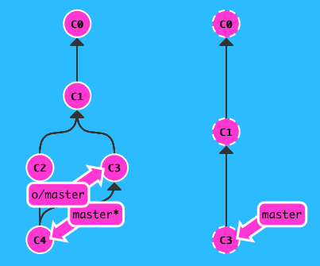

## 사다리 게임 요구사항

간단한 사다리 게임을 구현한다.
n개의 사람과 m개의 사다리 개수를 입력할 수 있어야 한다.
사다리는 랜덤으로 있거나 없을 수도 있다.
사다리가 있으면 -를 표시하고 없으면 " " 빈공백을 표시한다. 양옆에는 |로 세로를 표시한다.
사다리 상태를 화면에 출력한다. 어느 시점에 출력할 것인지에 대한 제약은 없다.

### 메소드 분리
>- indent depth를 2단계에서 1단계로 줄여라.
>- else를 사용하지 마라.
>- 메소드의 크기가 최대 10라인을 넘지 않도록 구현한다.
>- method가 한 가지 일만 하도록 최대한 작게 만들어라.

**문제점**: 

- 결과가 중복이 되진 않는지 확인한다.
- 사다리(-)가 같은 줄(row)에서 붙어있으면 안된다. 왼쪽이든 오른쪽이든 선택해야 하므로.

<br/>

## Git 협업

### Git - 리모트 저장소 개념

- 협업한다는 것은 데이터를 리모트 저장소에 push, pull, 관리하는 것을 의미.
- 리모트 저장소를 관리하는 것은 저장소 추가/삭제, 브랜치 관리/추적 등을 말함.

1. 리모트 저장소 확인
    - git remote [-v] : 현재 프로젝트에 등록된 리모트 저장소를 확인할 수 있음. 저장소를 Clone하면 origin이라는 리모트 저장소가 자동으로 등록됨.
2. 리모트 저장소 추가
    - git remote add [단축이름] [url]
3. 리모트 저장소 Pull / Fetch
    - git fetch [remote-name] : 로컬에는 없지만 리모트 저장소에는 있는 데이터를 모두 가져옴. 단, 자동으로 merge하지는 않음. (수동으로 해야)
    - git pull : fetch와 동시에 자동으로 로컬 브랜치와 merge 함.
    - git clone : 자동으로 로컬의 master 브랜치가 리모트의 master를 추적하도록 함. 그 후 pull 명령을 쓰면 clone한 서버에서 데이터를 가져오고 자동으로 현재 작업하는 코드와 merge 시킴.
4. 리모트 저장소에 Push
    - **git push [서버명] [브랜치명] 으로 쓰기도 하는데, 현재 브랜치에서 수정한 파일은 현재 브랜치로만 push 할 수 있다. 즉, 서버의 다른 브랜치명을 적더라도 현재 브랜치의 파일이 해당 브랜치로 push되진 않는다.**
5. 리모트 저장소 삭제 / 이름변경
    - git remote rname [이전이름] [새이름]
    - git remote rm [서버명]
6. 리모트 저장소의 모든 브랜치 목록 보기
    - git branch -r
    - 로컬 브랜치 목록은 git branch -l
    - 둘 다 보려면 git branch -a
7. 리모트 저장소 살펴보기
    - git remote show [서버명]
    
<br/>

### 협업과정 (Pull Request)



#### (단계별 브랜치를 생성 후 코딩 ➤ 완성 시 code-squad 서버로 PR ➤ 승인되면 내 저장소의 [내아이디] 브랜치로 fetch ➤ 내 서버로 다시 push.)
<br/>

1. 타겟 프로젝트의 저장소(repository)를 내 저장소로 **fork** 한 후, 내 컴퓨터로 **clone**.
	- clone 시, 자동으로 origin/master 브랜치를 트래킹하는 로컬 master 브랜치가 생성된다.
2. 해당 폴더로 이동 후 내 저장소의 [내아이디] 브랜치를 트래킹하는 브랜치 생성.
	- **git checkout -t origin/[브랜치명**(내아이디)**]** : origin 서버에 있는 브랜치를 트래킹하는 새 로컬 브랜치가 만들어지고, 해당 브랜치로 체크아웃된다. 이때 브랜치 이름은 자동으로 origin 서버의 브랜치와 동일하게 만들어진다. 이 트래킹 브랜치에서 git push 또는 pull 시, 서버의 해당 브랜치와 연결된다.
	- -t 옵션 : 새 branch를 만들 때, **upstream** 설정을 해 준다. 이 옵션을 쓰려면 upstream에 이미 본인 아이디 브랜치가 있어야 한다.
	- 이 단계는 다음 두 단계를 합친 것과 같다 :
		- git checkout -b [새 브랜치명] : 로컬에 새 브랜치를 만들고 체크아웃.
		- git push --set-upstream origin [새 브랜치명] : 새 로컬 브랜치의 upstream 지정. 서버에 '새 브랜치명'으로 브랜치가 생성됨. 이 때, 로컬과 서버의 브랜치명은 동일해야 함.
	- 참고 : [브랜치 추적](https://git-scm.com/book/ko/v2/Git-브랜치-리모트-브랜치#_tracking_branches)
3. 기능구현을 위한 브랜치를 단계별로 생성. 이전단계 브랜치는 삭제.
	- **git checkout -b ladder-step2** : 다음 단계 브랜치를 생성해서 이동.
	- **git branch -d ladder-step1** : 이전 브랜치는 삭제.
4. 커밋, 푸시, PR.
	1. 내 서버에 푸시 시, 현재 단계 브랜치를 연결.
		- **git push --set-upstream origin ladder-step1** : 서버에 현재 로컬 브랜치인  ladder-step1 브랜치와 같은 이름의 브랜치를 생성하고 연결함.
	2. Pull Request 시, base와 compare를 다음 기준으로 함.
		- base : **code-squad/[프로젝트명] [내아이디] 브랜치** => compare : **[내서버]/[프로젝트명] [현재단계] 브랜치**
		- base branch를 기준으로 compare branch의 변화를 논의할 수 있다.
5. 코드 리뷰, 개선작업, 재푸시.
6. 로컬의 [내아이디] 브랜치와 code-squad 서버 연결 설정 (최초 1회)
	- **git checkout [내아이디]** : 로컬의 [내아이디] 브랜치로 체크아웃.
	- **git remote add upstream [외부서버]** : [내아이디] 브랜치의 upstream 서버 지정. pull 또는 push 시 upstream 서버와 연결할 수 있음.
	- git remote -v : 현재 브랜치에 연결된 서버를 확인할 수 있다.
7. PR 보낸 내용을 내 저장소와 합침.
	- 이제까지 단계별 브랜치 내용을 code-squad 서버의 [내아이디] 브랜치로 PR을 보내서 합침.
	- **git fetch upstream** : code-squad 서버의 [내아이디] 브랜치의 내용을 로컬로 가져옴.
		- git fetch는 서버에는 있지만 로컬에는 없는 커밋들을 다운로드 받고, 트래킹브랜치(원격브랜치)가 가리키는 곳을 업데이트함(예: origin/master, upstream/undervineg). 하지만, 로컬의 상태는 변경 안 함(예: master) 
		- 
		- 반면, git pull은 fetch + merge를 한 번에 수행. 
		- 
	- **git rebase upstream/[내아이디]** : upstream을 fetch 후 upstream/[내아이디]브랜치는 원격과 동일한 최신 커밋을 가리키고 있지만, 로컬의 [내아이디] 브랜치는 기존 커밋을 가리키고 있음. 로컬의 [내아이디] 브랜치도 최신 커밋을 가리키도록 rebase.
	- **git push** : code-squad 서버에서 최신 커밋을 받아 업데이트한 로컬 [내아이디]브랜치를 내 서버(origin)로 다시 업로드.

### Git Base 강의 요약
- 로컬저장 = commit
- 원격저장 = push
- .git = 로컬저장소
- 개발할 때는 working directory를 건드리고, 저장할 때는 .git을 건드림
- ‘-‘는 단축옵션, ‘—‘는 진짜옵션 ex) —global, -al
- add : 작업내용을 working directory에서 stage(=index)에 올리는 명령어
- commit: 저장. 누군가의 컴퓨터 상태.
- git commit 객체는 전세계적으로  다르다. 즉, ID가 다 다르다.
- master: 에러 없는 깨끗한 버전을 넣는다. (실제 릴리즈 서버에 올릴 파일) 보통 master엔 작업을 하면 안된다.
- 코딩 시에는 새 branch를 만들어서 개발을 한 후, merge를 한다. 
- merge도 새로운 commit을 만드는데, 누군가의 컴퓨터 상태가 아니기 때문에 메타 커밋이라고 부름.
- push: 내 현재 브랜치만 원격에 저장.
- origin: 원격저장소의 별명
- git push origin master : 내 master 브랜치를 origin 서버에 올린다.
- pull = fetch + merge
- fetch : 원격저장소와 로컬저장소만 똑같이 만들어줌
- merge: 원격저장소의 내용과 로컬 작업디렉토리를 합치는 것
- 같은 부위를 수정하면 충돌남 : <<<HEAD 부터 —— 까지는 HEAD가 가리키는 파일 내용이고, ——부터 >>>> [브랜치] 는 브랜치가 가리키는 파일 내용이다.

### Git Basic-advanced 강의 요약
- 깃에는 객체와 참조 밖에 없다. 객체는 commit. 참조는 branch.
- head : 가장 마지막 commit의 참조.
- commit : head에 자식을 만들어주는 것. 
- branch : 객체의 참조일 뿐. head자리에 생성됨
- detached branch : 어느 브랜치에도 속하지 않을 때. 예를 들어 head만 옮겼을 때 등. (HEAD->브랜치 형태로 표시되지 않음). 좋지 않은 형태이다.
- checkout : HEAD에 해당 브랜치의 주소를 가리키게 함
- 현재 브랜치 망해서 다른 커밋에서 브랜치를 만들어서 작업하고 싶을 때: git branch []
- tag : 사람들이 사용할만한 버전에 붙임. 이것도 커밋의 참조 중 하나. tag로도 checkout 된다. tag는 branch와 달리 움직이지 않는다는 차이가 있다. (브랜치 이름과 겹치면 안됨)
- push : 푸시한다고 전체가 푸시되지 않음
- add 가 있는 이유 : 커밋 단위는 무조건 한 문장으로 설명할 수 있는 단위이다. add로 커밋 단위를 쪼갤 수 있다.
- merge: 다른 브랜치를 하나의 새로운 commit으로 합침. 따라서 부모가 두 명.
- rebase: 로컬에서만 사용하는 것이 좋다.  두 브랜치의 차이를 밝혀서 한 브랜치로 만들어줌. 
- stash: 워킹디렉토리에 unstaged 파일들을 백업하고 워킹디렉토리를 깨끗한 상태, 즉 HEAD의 상태로 만드는 것. git 저장소에 아직 커밋하지 않은 변경사항이 있는 경우, rebase 시도 시 실패하게 됨. 이런 경우 등등에 git stash 를 사용하여 unstaged 상태인 변경사항을 일시적으로 백업하고 워킹디렉토리를 깨끗한 상태로 유지한다. 저장한 내역은 git stash list로 조회할 수 있다. 워킹 디렉토리에 다시 적용하려면 git stash pop을 사용한다. pop 하지 않고 적용만 하려면 git stash apply를 한다.


## 기타

### 삼항연산자
> Conditional operator - () : () ? ()
> Nil-coalescing operator - ??
 

### Error Handling
> throws : 함수를 실행하다가 중간에 돌아올 수 있다는 뜻.
> 중간에 빠져나올 수 있는 함수는 실행 시 do { try } catch가 필요함.

- 정의부

```
func makeASandwich() throws {
	...
}
```

- 호출부

```
do{
	try makeASandwich()
}catch 조건비교 {
	다른동작
}
```


- 반면, 리턴타입이 옵셔널 타입인 경우, 반환값만 가지고 예외처리를 할 수 있기 때문에 중간에 돌아올 필요가 없기 때문에 do-try는 필요없다.

 
`let result = try? buySandwich()` 

> 옵셔널타입 으로 반환(권장)

`let result = try! buySandwich()` 

> 값타입 으로 반환


### XCode
> break point를 잡으면 그 줄 직전까지만 실행되고 멈춤. break point 잡은 줄부터 한 줄씩 실행 가능.